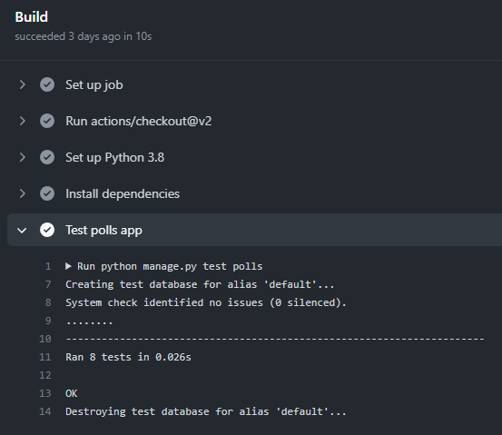

Github actions is an automation tool used to create software development lifecycle workflows such as build a web project, create a container, test an api, and so on. Github actions is built in Github and can be run directly in a Github repo.  Github actions can be triggered by events like a pull request, pushing updates, and others events that appear in a software development workflow.

We are going to show how to use Github actions to test a django application, specifically, the django polls application featured in the official documentation ([Django tutorial](https://docs.djangoproject.com/en/4.0/intro/tutorial05/)). Let's say we already have the basic polls application and we are in Part 5 of the tutorial which deals with testing. 

An example of a test suggested in the django tutorial is this one:

```
    import datetime
    from django.urls import reverse
    from django.test import TestCase
    from django.utils import timezone

    from .models import Question

    class QuestionModelTests(TestCase):

        def test_was_published_recently_with_future_question(self):
            """
            was_published_recently() returns False for questions whose pub_date
            is in the future.
            """
            time = timezone.now() + datetime.timedelta(days=30)
            future_question = Question(pub_date=time)
            self.assertIs(future_question.was_published_recently(), False)

        def test_was_published_recently_with_old_question(self):
            """
            was_published_recently() returns False for questions whose pub_date
            is older than 1 day.
            """
            time = timezone.now() - datetime.timedelta(days=1, seconds=1)
            old_question = Question(pub_date=time)
            self.assertIs(old_question.was_published_recently(), False)
```

We can carry out the tests using pytest. First we have to install pytest:

```
    $ pip install pytest-django
```

Then we have to create a configuration file called **pytest.ini**:

```
    # -- FILE: pytest.ini (or tox.ini)
    [pytest]
    DJANGO_SETTINGS_MODULE = test.settings
    # -- recommended but optional:
    python_files = tests.py test_*.py *_tests.py
```

Then we just execute this command to run the tests on our local machine:

```
    $ pytest
```


In order to automate this workflow on Github, we need to create a directory called **.github/workflows**, and inside we add a file with a **.yml** or **.yaml** extension, for instance, **test-polls.yml** with this content:

```
    name: Testing with Github actions
    on: [push]
    jobs:
    Build:
        runs-on: ubuntu-latest
        steps:
        # Checkout the GitHub repo
        - uses: actions/checkout@v2

        # Install Python 3.8
        - name: Set up Python 3.8
            uses: actions/setup-python@v2
            with:
            python-version: "3.8"

        # Pip install project dependencies
        - name: Install dependencies
            run: |
            python -m pip install --upgrade pip
            pip install -r requirements.txt

        # Run test
        - name: Test polls app
            run: pytest -vv
```

In general terms this is what each section of the workflow means:

**runs-on: ubuntu-latest**: the runner uses an instance of the latest version of ubuntu

**on: [push]**: the action is triggered every time there is a push or when a pull request is merged

**- uses: actions/checkout@v2**: the repo must be checked out so the action has access to it

**uses: actions/setup-python@v2**: a python environment is set up

**python-version: "3.8"**: the python version is added to the PATH

**- name: Install dependencies**: the needed dependencies are installed

**- name: Test polls app**: when the environment is all set up, the main event is triggered

After we push the repo to Github, the action can be triggered. On Github we can check the logs of the build. For instance:

